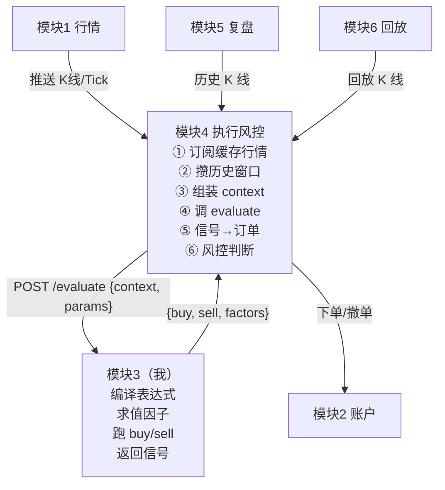
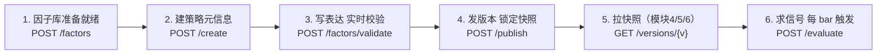
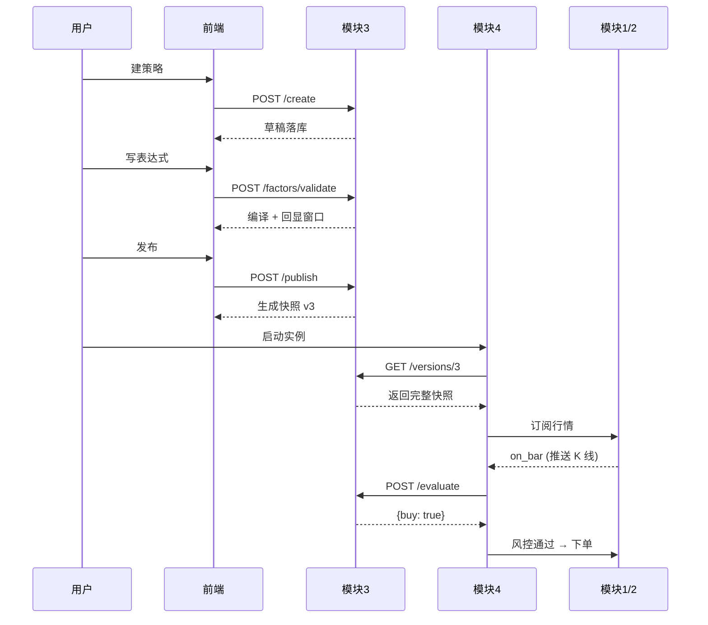

# 策略引擎与策略管理 — 对外接口契约

> 模块代号：`strategy_engine`（模块3） · API 前缀：`/api/strategy`
> 本文档面向**其他模块开发者**与**前端开发者**，描述：
> 1. 我（模块3）需要其他模块为我提供什么
> 2. 我对外提供的接口如何使用
>

---

## 概览：数据流与职责切分

### 一句话理解模块3

> 模块3 是**无状态的纯函数引擎**：输入 `(策略快照, 当前行情上下文, 参数)`，输出 `{buy, sell}`。
> 模块3 **不订阅行情、不持有运行循环、不下单、不做风控**。

### 数据流总图



**关键点**：

1. 行情数据**不流经我**，由模块4/5/6 在调用我之前组装好 `context` 一起传入
2. 我不知道也不需要知道这只是 BTC/USDT 还是 AAPL、是实盘还是回测
3. 同一份 evaluate 接口同时服务实盘、回测、回放，**保证三者策略行为完全一致**

### 职责切分表（消除歧义）

| 事项 | 模块3（我） | 模块4（执行风控） |
|---|---|---|
| 订阅模块1 行情推送 | ❌ | ✅ |
| 维护历史 K 线缓存 | ❌（窗口由调用方传入） | ✅ |
| 编译/校验策略表达式 | ✅ | ❌ |
| 跑 buy/sell 表达式得到信号 | ✅ | ❌ |
| 信号 → 订单（价格/数量/方向） | ❌ | ✅ |
| 调用模块2 下单/撤单 | ❌ | ✅ |
| 实时风控（最大回撤、单笔亏损） | ❌ | ✅ |
| 维护策略 CRUD 与版本快照 | ✅ | ❌ |
| 持有运行循环（while True / 定时器） | ❌ | ✅ |

### 两种求值姿势（消费方按场景选）

| 姿势 | 调用 | 适用 |
|---|---|---|
| **远程求值** | 每帧 `POST /evaluate` | 实盘低频（5min/1h/daily），网络往返可接受；调试方便 |
| **本地求值** | 启动时 `GET /versions/{v}` 拉快照，消费方自己用 simpleeval 跑 | 高频（tick/1min）、回测百万次循环 |

快照中包含完整的 `buy_expression / sell_expression / factor_bindings / compiled_meta`，消费方在 Python 进程内复用 simpleeval 即可，**无需每次过 HTTP**。

---

## 第一部分：我需要你们提供什么

### 1.1 模块1（API对接展示信息和数据）

| 项目 | 期望 | 备注 |
|---|---|---|
| K 线/Tick 字段命名 | 严格使用 `open / high / low / close / volume / amount / ts` | 我的因子表达式硬编码这些名称，**请勿改名**。如需扩展字段请提前同步 |
| 时间戳单位 | **毫秒整数（int）** | 字段名 `ts`，UTC 时区 |
| 数值类型 | 价格 `float`、成交量 `float`、时间戳 `int` | 不接受字符串或 Decimal |
| 历史 K 线方向 | **从早到晚（升序）**，最新一根在末尾 | 调用我的 evaluate 时 history 数组顺序 |
| 不需要提供 | WebSocket 推送、订阅机制、连接状态 | 我不订阅你的数据流 |

**接口调用方向**：你 → 我 ❌，我 → 你 ❌（**完全解耦**，仅约定字段名）

### 1.2 模块2（帐户与交易）

| 项目 | 期望 |
|---|---|
| 无依赖 | 本模块不感知账户、持仓、资金 |

### 1.3 模块4（策略执行与实时风控）

| 项目 | 期望 | 备注 |
|---|---|---|
| 拉取策略快照 | 调用 `GET /api/strategy/{id}/versions/{v}` | 启动策略时拉一次，本地缓存即可 |
| **按 `required_data` 准备数据** | 读快照的 `compiled_meta.required_data`，逐项准备 ohlcv/fundamental/account/crosssection | 本模块会告诉你需要哪些字段、历史窗口多长，你**无需自己维护「因子 → 基础数据」映射表** |
| 单点求值 | 调用 `POST /api/strategy/{id}/evaluate` | 每根 bar/tick 触发一次 |
| Context 准备 | 你负责拼装 context（当前 bar + 历史 bars + 可选 fundamental/account/crosssection 字段） | history 长度需 ≥ `compiled_meta.max_history_window` |
| 参数注入 | 在 evaluate 请求体中传入 `params` 覆盖默认值 | 用于策略实例的可调参数 |
| 求值结果消费 | 我返回 `{buy: bool, sell: bool, ...}`；你自行决定如何转订单 | 我不做「信号→订单」转换 |

### 1.4 模块5（复盘分析与策略优化）

| 项目 | 期望 |
|---|---|
| 关联回测 | 你的回测结果表中保存 `strategy_id + version_id`，引用我的版本快照 |
| 拉取参数 schema | 调用 `GET /api/strategy/{id}/versions/{v}` 获取 `params_schema`，用于参数优化网格搜索 |
| 不需要 | 不需要我提供绩效指标计算、不需要我执行回测 |

### 1.5 模块6（历史回放策略模拟）

| 项目 | 期望 |
|---|---|
| 与模块4一致 | 拉快照 + 调用 evaluate 求信号，与实盘逻辑完全一致（"使用相同策略引擎"诉求由此满足） |
| 时间戳 | 在 context.ts 中传入回放时间点（毫秒），我不感知"回放还是实盘" |

### 1.6 公共模块（common）

| 项目 | 期望 |
|---|---|
| `Base` / `TimestampMixin` | 我会继承使用 |
| `get_db()` | 我会注入使用 |
| `request` axios 拦截器 | 前端调用我时统一走该拦截器 |
| 路由注册 | 我会在 `backend/main.py` 通过 `include_router` 自助注册 `strategy_engine.router` |
| 前端路由 | 在 `routes.ts` 注册 `/strategies` / `/strategies/:id/editor` / `/strategies/:id/versions` / `/factors`，需公共模块维护者协助合并 |

---

## 第二部分：我对外提供的接口

### 2.1 通用约定

- **Base URL**：`/api/strategy`
- **响应格式**：统一为 `ApiResponse<T>`

  ```jsonc
  // 成功
  {"success": true, "data": <T>, "message": "操作成功"}

  // 失败
  {"success": false, "message": "...", "error_code": "...", "detail": {...}}
  ```

- **分页查询参数**：`page` (默认 1)、`page_size` (默认 20)
- **分页响应**：

  ```jsonc
  {"success": true, "data": {"items": [...], "total": 100, "page": 1, "page_size": 20}}
  ```

- **时间字段**：ISO 8601 字符串，如 `"2026-05-19T08:30:00Z"`
- **错误码**：见本文档 §3 错误码表

---

### 2.2 因子相关接口

#### `GET /api/strategy/factors`

列出所有因子（含内置）。

**Query**：

| 参数 | 类型 | 默认 | 说明 |
|---|---|---|---|
| category | string? | 全部 | `builtin` / `user` / `derived` |
| keyword | string? | — | 模糊匹配 name / description |
| page | int | 1 | |
| page_size | int | 20 | |

**响应 data.items[*]**：

```jsonc
{
  "id": 1,
  "name": "ma20",
  "category": "derived",
  "expression": "MA(close, 20)",
  "data_type": "number",
  "data_source": {
    "type": "derived",
    "depends_on": ["close"]
  },
  "description": "20日均线",
  "is_builtin": false,
  "created_at": "2026-05-19T08:00:00Z",
  "updated_at": "2026-05-19T08:00:00Z"
}
```

> `data_source` 字段是本模块给消费方的**「数据准备说明书」**，取值枚举与语义详见 [`DESIGN.md` §3.3](./DESIGN.md#33-因子的数据来源约定重要)。
> **消费方不需要在本地维护「因子 → 基础数据」映射表**，只需读策略快照的 `compiled_meta.required_data` 聚合清单（见 §2.4）。

#### `POST /api/strategy/factors`

创建用户/衍生因子。

**Body**：

```jsonc
{
  "name": "ma20",
  "category": "derived",            // user | derived
  "expression": "MA(close, 20)",    // category=derived 时必填
  "data_type": "number",            // number | bool | series
  "description": "20日均线"
}
```

**响应**：同 `FactorResponse`。

**错误码**：`FACTOR_NAME_CONFLICT` / `EXPRESSION_SYNTAX_ERROR` / `EXPRESSION_SECURITY_ERROR` / `EXPRESSION_UNKNOWN_NAME` / `EXPRESSION_CIRCULAR_REF`

#### `PUT /api/strategy/factors/{id}`

修改非内置因子。Body 同 POST。

**错误码**：`FACTOR_NOT_FOUND` / `FACTOR_BUILTIN_PROTECTED`

#### `DELETE /api/strategy/factors/{id}`

删除非内置因子。如有策略版本快照仍引用，会拒绝（`FACTOR_IN_USE`）。

#### `POST /api/strategy/factors/validate`

仅校验表达式，不入库。前端编辑器实时调用。

**Body**：

```jsonc
{
  "expression": "MA(close, 20) > EMA(close, 50)",
  "context_fields": ["open","high","low","close","volume","amount","ts"],
  "available_factors": ["ma20", "ema50"]   // 可选
}
```

**响应 data**：

```jsonc
{
  "valid": true,
  "depends_on_fields": ["close"],
  "depends_on_factors": [],
  "max_history_window": 50,
  "warnings": []
}
```

校验失败时 `valid=false`，并在 `message` 中提供错误原因，`detail` 含 AST 行列定位（如有）。

---

### 2.3 策略相关接口

#### `GET /api/strategy/list`

策略列表。

**Query**：`status?` / `keyword?` / `page` / `page_size`

**响应 data.items[*]**：

```jsonc
{
  "id": 42,
  "name": "趋势突破策略",
  "description": "...",
  "status": "active",
  "timeframe": "5min",
  "current_version_id": 100,
  "current_version_no": 3,
  "created_at": "...",
  "updated_at": "..."
}
```

#### `POST /api/strategy/create`

创建策略草稿。

**Body**：

```jsonc
{
  "name": "趋势突破策略",
  "description": "...",
  "timeframe": "5min"
}
```

**响应**：`StrategyResponse`，初始 `status="draft"`，`current_version_id=null`。

#### `GET /api/strategy/{id}`

策略详情。

**响应 data**：

```jsonc
{
  "id": 42,
  "name": "趋势突破策略",
  "description": "...",
  "status": "active",
  "timeframe": "5min",
  "current_version_id": 100,
  "current_version": { /* 见 2.4 StrategyVersionResponse */ },
  "created_at": "...",
  "updated_at": "..."
}
```

#### `PUT /api/strategy/{id}`

修改策略元信息（仅 name / description / timeframe）。**已 active 的策略可改元信息但不可改 timeframe**（影响快照解读）。

#### `DELETE /api/strategy/{id}`

删除策略。`status=active` 拒绝（`STRATEGY_IN_USE`），需先归档。

---

### 2.4 策略版本接口（核心对外接口）

#### `POST /api/strategy/{id}/publish`

发布新版本（创建一份不可变快照）。

**Body**：

```jsonc
{
  "buy_expression": "CROSS(close, ma20) AND rsi14 < rsi_oversold",
  "sell_expression": "CROSS(ma20, close) OR rsi14 > rsi_overbought",
  "factor_bindings": [
    {"factor_id": 1, "alias": "ma20"},
    {"factor_id": 5, "alias": "rsi14"}
  ],
  "params_schema": [
    {"name": "rsi_oversold", "type": "int", "default": 30, "min": 5, "max": 50},
    {"name": "rsi_overbought", "type": "int", "default": 70, "min": 50, "max": 95}
  ],
  "params_default": {"rsi_oversold": 30, "rsi_overbought": 70}
}
```

**响应 data（`StrategyVersionResponse`）**：

```jsonc
{
  "id": 100,
  "strategy_id": 42,
  "version_no": 3,
  "buy_expression": "...",
  "sell_expression": "...",
  "factor_bindings": [...],
  "params_schema": [...],
  "params_default": {...},
  "compiled_meta": {
    "buy": {
      "depends_on_fields": ["close"],
      "depends_on_factors": ["ma20", "rsi14"],
      "max_history_window": 20
    },
    "sell": {
      "depends_on_fields": ["close"],
      "depends_on_factors": ["ma20", "rsi14"],
      "max_history_window": 20
    },
    "required_data": {
      "ohlcv":       { "fields": ["close"], "history_window": 20 },
      "fundamental": { "fields": [] },
      "account":     { "fields": [] },
      "crosssection":[]
    },
    "warnings": []
  },
  "created_at": "..."
}
```

发布成功后 `strategy.current_version_id` 自动指向新版本，`status` 变为 `active`。

#### `GET /api/strategy/{id}/versions`

版本列表（按 version_no 倒序）。

**Query**：`page` / `page_size`

**响应 data.items[*]**：同 `StrategyVersionResponse`（精简：不含 compiled_meta，可由 `?detail=true` 展开）。

#### `GET /api/strategy/{id}/versions/{version_no}`

**【模块4/5/6 关键接口】** 拉取指定版本完整快照。

**响应**：完整 `StrategyVersionResponse`。

> **使用建议**：消费方启动时拉一次，本地缓存。版本不可变，无需轮询。
> 如需要"切换到最新版本"，监听前端事件或定期检查 `current_version_id` 变化。

---

### 2.5 求值接口（核心对外接口）

#### `POST /api/strategy/{id}/evaluate`

单点求值。给定上下文与参数，返回买卖信号。

**Body**：

```jsonc
{
  "version_id": 100,                  // 可选，缺省使用 current_version_id
  "params": {                         // 可选，覆盖 params_default
    "rsi_oversold": 25
  },
  "context": {
    "open":   42150.0,
    "high":   42380.0,
    "low":    42020.0,
    "close":  42300.0,
    "volume": 1234.56,
    "amount": 52000000.0,
    "ts":     1747641600000,          // 毫秒时间戳
    "history": {                      // 历史窗口，长度 ≥ compiled_meta.max_history_window
      "open":   [42000.0, 42100.0, ...],
      "high":   [42200.0, 42300.0, ...],
      "low":    [41950.0, 42050.0, ...],
      "close":  [42100.0, 42200.0, ...],
      "volume": [1100.0,  1150.0,  ...]
    }
  },
  "debug": false                      // true 时返回所有中间因子值
}
```

**响应 data**：

```jsonc
{
  "strategy_id": 42,
  "version_id": 100,
  "version_no": 3,
  "ts": 1747641600000,
  "buy": true,
  "sell": false,
  "factors": {                        // debug=true 时存在
    "ma20": 42150.5,
    "rsi14": 28.4
  },
  "elapsed_ms": 3
}
```

**约束**：

- `context.history` 数组**升序**（最早 → 最新），最新值不重复包含当前 bar
- 长度不足 `max_history_window` 返回 `EVAL_CONTEXT_INSUFFICIENT`
- 字段缺失返回 `EVAL_CONTEXT_INSUFFICIENT`，`detail.missing_fields` 给出列表
- 参数超出 schema 范围返回 `EVAL_PARAM_OUT_OF_RANGE`
- 单次求值软超时 100ms，超时返回 `EVAL_TIMEOUT`（500）

**消费方典型用法**：

```python
# 模块4 伪代码
snapshot = await fetch("/api/strategy/42/versions/3")  # 启动时拉一次
window = snapshot["compiled_meta"]["buy"]["max_history_window"]

async def on_bar(bar, history):
    ctx = build_context(bar, history[-window:])
    result = await post(f"/api/strategy/42/evaluate", json={
        "version_id": 3, "params": {...}, "context": ctx
    })
    if result["data"]["buy"]:
        place_order(...)
```

---

### 2.6 策略组合接口

#### `GET /api/strategy/groups`

组合列表。

#### `POST /api/strategy/groups`

```jsonc
{
  "name": "稳健组合",
  "description": "...",
  "allocations": [
    {"strategy_id": 42, "version_id": 100, "weight": 0.6},
    {"strategy_id": 51, "version_id": 130, "weight": 0.4}
  ]
}
```

约束：`sum(weight) === 1.0`（容差 1e-6），违反返回 `GROUP_WEIGHT_INVALID`。

#### `GET /api/strategy/groups/{id}` / `PUT` / `DELETE`

详情 / 修改 / 删除。

---

## 第三部分：错误码索引

| `error_code` | HTTP | 说明 |
|---|---|---|
| `STRATEGY_NOT_FOUND` | 404 | 策略不存在 |
| `STRATEGY_VERSION_NOT_FOUND` | 404 | 版本不存在 |
| `STRATEGY_IN_USE` | 409 | 策略仍在 active，禁止删除 |
| `STRATEGY_VERSION_IMMUTABLE` | 409 | 试图修改已发布版本 |
| `FACTOR_NOT_FOUND` | 404 | 因子不存在 |
| `FACTOR_NAME_CONFLICT` | 409 | 因子名重复 |
| `FACTOR_BUILTIN_PROTECTED` | 403 | 试图修改/删除内置因子 |
| `FACTOR_IN_USE` | 409 | 因子被某版本快照引用，禁止删除 |
| `EXPRESSION_SYNTAX_ERROR` | 422 | 表达式语法错 |
| `EXPRESSION_SECURITY_ERROR` | 422 | 命中 AST 黑名单 |
| `EXPRESSION_UNKNOWN_NAME` | 422 | 引用未定义的因子或字段 |
| `EXPRESSION_CIRCULAR_REF` | 422 | 衍生因子循环引用 |
| `EXPRESSION_TOO_LONG` | 422 | 表达式超过 2000 字符 |
| `EVAL_CONTEXT_INSUFFICIENT` | 422 | context 缺字段或历史不够长 |
| `EVAL_PARAM_OUT_OF_RANGE` | 422 | 参数超出 schema 范围 |
| `EVAL_TIMEOUT` | 500 | 求值超过 100ms |
| `GROUP_WEIGHT_INVALID` | 422 | 组合权重之和 ≠ 1.0 |

---

## 第四部分：常见集成示例

### 4.1 模块4 接入流程（实盘执行）

1. 用户在前端启动策略实例 → 模块4 收到 `{strategy_id, version_id, params}`
2. 模块4 调用 `GET /api/strategy/{id}/versions/{v}` 拉取快照（含 `max_history_window`）
3. 模块4 订阅模块1 的行情，准备 history 缓存（长度按 `max_history_window`）
4. 每根 bar/tick 触发：调用 `POST /api/strategy/{id}/evaluate`
5. 收到 `{buy, sell}` 后由模块4 自行做"信号 → 订单"转换 + 风控判断 + 下单（调模块2）

### 4.2 模块5 接入流程（参数优化）

1. 用户选择某 `strategy_id + version_id` → 模块5
2. 模块5 调用 `GET /api/strategy/{id}/versions/{v}` 拿 `params_schema`
3. 按 schema 中的 `min/max/options` 进行网格/遗传搜索
4. 每组参数走一遍历史回放（调用 evaluate 或本地 eval 快照）
5. 模块5 计算绩效指标 → 入库 `backtest_results(strategy_id, version_id, params, metrics)`

### 4.3 模块6 接入流程（历史回放）

与模块4 完全一致，差别仅在于：

- 行情来源是历史数据加载器而非实时推送
- `context.ts` 传入回放时间戳
- "下单"是模拟撮合，不调模块2

由于使用同一份 evaluate 接口，**回放与实盘的策略行为天然一致**。

### 4.4 策略使用的步骤流程（快速上手）

> 本小节面向**首次接入**模块3 的开发者与产品同学，用一张时序图串起「准备因子 → 编写策略 → 发布版本 → 实盘求值」的全链路。
> 每一步都标注了**谁来做、调哪个接口、得到什么、下一步用在哪**。

#### 流程总览



#### 1. 准备因子（一次性，可复用）

1. 由前端因子管理页或脚本调用 `GET /api/strategy/factors` 看清已有因子
2. 内置因子（`is_builtin=true`）开箱即用，**无需重复创建**，例如 `MA / EMA / RSI / CROSS / close / volume` 等
3. 业务自定义指标走 `POST /api/strategy/factors`，按 [§2.2](#22-因子相关接口) 填 `name / category / expression / data_type`
4. 拿到响应中的 `data.id`，后续策略版本通过 `factor_bindings.factor_id` 引用

#### 2. 创建策略（草稿态）

1. 调用 `POST /api/strategy/create`，传入 `name / description / timeframe`
2. 返回的策略 `status="draft"`、`current_version_id=null`，此时**不可被 evaluate**
3. 记下 `data.id` 作为后续所有版本接口的 `{id}` 路径参数

#### 3. 编辑并实时校验表达式

1. 前端编辑器在用户输入 `buy_expression / sell_expression` 过程中按 debounce 500ms 调 `POST /api/strategy/factors/validate`
2. 校验响应里的 `depends_on_fields / depends_on_factors / max_history_window` 直接回填到编辑器侧栏，让用户看到"我这个表达式需要哪些数据、要多长历史窗口"
3. 命中错误码（如 `EXPRESSION_SYNTAX_ERROR`、`EXPRESSION_UNKNOWN_NAME`）时按 `detail` 中的行列高亮报错
4. 通过校验后才允许进入下一步「发布」

#### 4. 发布策略版本（生成不可变快照）

1. 调用 `POST /api/strategy/{id}/publish`，传入 `buy_expression / sell_expression / factor_bindings / params_schema / params_default`
2. 后端会**再编译一次**表达式并生成 `compiled_meta`（含聚合后的 `required_data`），与 §3 校验结果一致才算合法
3. 发布成功后：策略 `status` 自动变为 `active`，`current_version_id` 指向新版本，`version_no` 自增
4. **重点**：版本快照永远不可改。需要修改逻辑 → 重新走 §3 + §4 生成新版本（旧版本仍可被回测/复盘引用）

#### 5. 消费方拉取快照（启动期一次）

1. 模块4/5/6 启动策略实例时调 `GET /api/strategy/{id}/versions/{version_no}` 拉一次完整快照，**本地缓存**
2. 读 `compiled_meta.required_data`，按 `ohlcv.fields` / `ohlcv.history_window` / `crosssection` / `account.fields` 等**逐项准备数据源**
3. **不要**自己维护「因子 → 基础数据」映射表，全部以 `required_data` 为准（避免新增因子时漏改）
4. 版本不可变 → 缓存可永久持有；若用户切到新版本，由前端通知或定期对比 `current_version_id`

#### 6. 单点求值（每根 bar / tick 触发）

1. 模块4 在收到一根新 K 线时，按 §5 拿到的 `required_data` 拼装 `context`（当前字段 + `history` 升序数组）
2. 调用 `POST /api/strategy/{id}/evaluate`，可选传 `version_id` 锁定版本、`params` 覆盖默认参数
3. 响应 `{buy, sell}` 即为本帧信号；调试时传 `debug=true` 可拿到所有中间因子值
4. 模块4 拿到信号后**自行**做风控/转单/下单，模块3 只管"算"，不管"做"

#### 7. 高频场景的本地求值替代（可选）

1. 若策略运行在 tick 级或回测百万次循环，HTTP 往返成本不可接受
2. 启动时按 §5 拉快照 → 在消费方进程内用 `simpleeval` 复用 `compiled_meta` 直接求值
3. 求值结果与 `/evaluate` 接口**完全一致**（同一编译产物 + 同一沙箱）
4. 仅在策略**新增/切换版本**时重新拉快照，整个生命周期不再走 HTTP

#### 关键时序图（实盘最小闭环）



#### 我应该从哪一步开始？（场景速查）

| 你的角色 | 起点 | 终点 |
|---|---|---|
| 产品 / 普通用户 | 步骤 1 → 2 → 3 → 4 | 看到策略 `status=active` 即可 |
| 模块4（实盘执行）开发 | 步骤 5 → 6 | 收到信号后接模块2 下单 |
| 模块5（复盘优化）开发 | 步骤 5 → 6（或 §7）| 跑历史 K 线得到信号序列后做绩效统计 |
| 模块6（历史回放）开发 | 步骤 5 → 6 | 喂回放 K 线，使用同一 evaluate 保持行为一致 |
| 第三方/脚本调用方 | 步骤 5 → 6 | 仅用 HTTP 也能完整跑通 |

### 4.5 前端编辑器接入

```typescript
// frontend/src/strategy-engine/api/factor.ts
import request from '@/common/utils/request'

export function validateExpression(expression: string, availableFactors: string[]) {
  return request.post('/strategy/factors/validate', {
    expression,
    context_fields: ['open','high','low','close','volume','amount','ts'],
    available_factors: availableFactors,
  })
}
```

编辑器在 `onBlur` 或 debounce 500ms 后调用 `validateExpression`，根据响应高亮错误位置。

